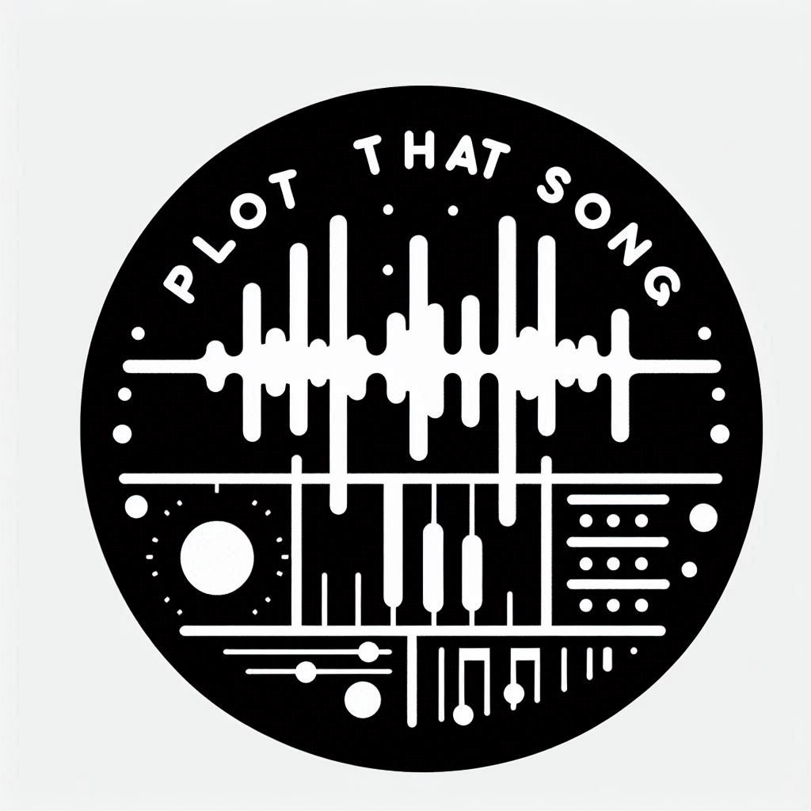

# dasp

<i> Plot That Song </i>

&nbsp; Creative project that merges Music Information Retrieval (MIR) and artistic pen plotter technology

&nbsp; Extracts and visualizes: Spectrograms, waveforsm, beat-ticks and music-related information.

&nbsp; Plots subprocessed to be penplotter after.

Plot That Song is a "pseudoartistic" project that combines music information retrieval with pen plotter technology to create visual representations of songs. This is the first iteration, with more features planned for future development. Currently, the visualizations are generated using Python, utilizing libraries such as librosa and essentia.

The plots incorporate the following extracted information: waveforms (left and right channels), spectrograms, envelope, beats (using Essentia's RhythmExtractor), and BPM.

## Examples

